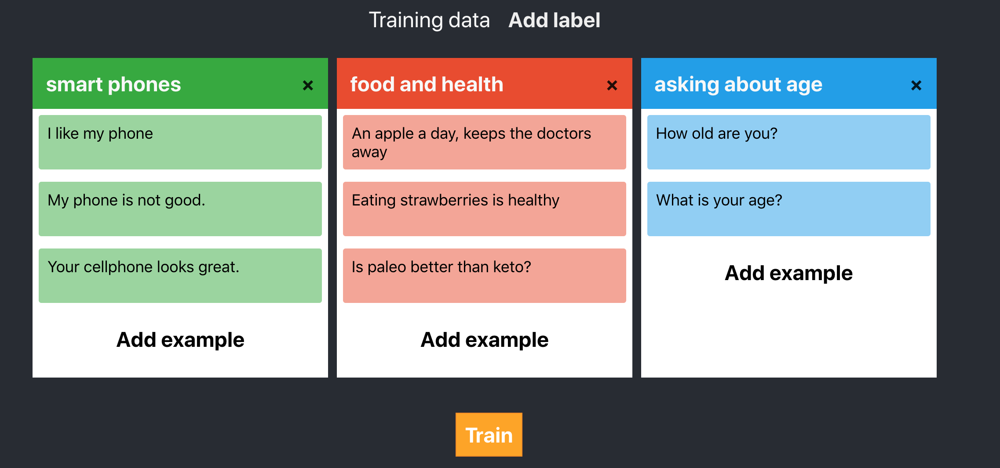
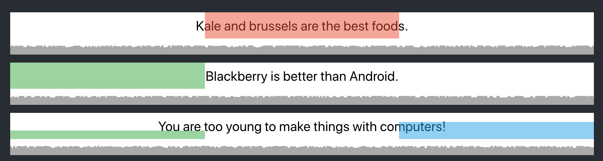

# tiny-trainer
experiment with using the universal sentence encoder and KNN to make a classifier from small training sets

### Demo
https://tiny-trainer.netlify.com/

### References
- https://github.com/tensorflow/tfjs-models/blob/master/universal-sentence-encoder/demo/index.js
- https://github.com/tensorflow/tfjs-models/tree/master/knn-classifier
- https://machinelearningforkids.co.uk

### Development
In the project directory, you can run:

### `npm start`

Runs the app in the development mode. 
Open [http://localhost:3000](http://localhost:3000) to view it in the browser.

This project was bootstrapped with [Create React App](https://github.com/facebook/create-react-app).
