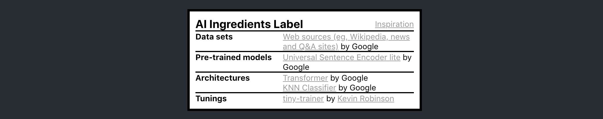
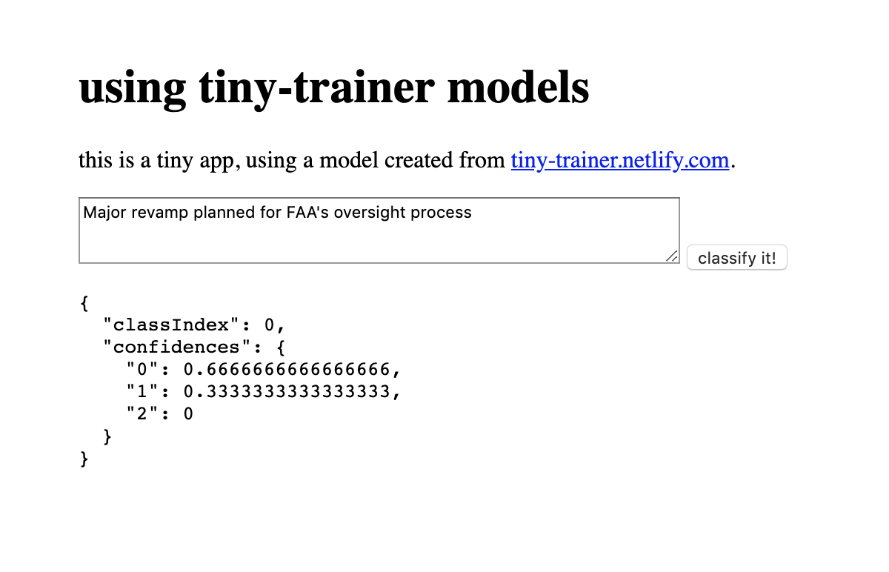

# tiny-trainer
experiment with using the universal sentence encoder and KNN to make a classifier from small training sets

### Demo
https://tiny-trainer.netlify.com/




### Using your models
You can click "Copy!" to get script tags you paste in an HTML page to make predictions in your own app.



For an example in repl.it, see [https://repl.it/@kevinrobinson/WeeFancyTriangles](https://repl.it/@kevinrobinson/WeeFancyTriangles)


### References
- https://github.com/tensorflow/tfjs-models/blob/master/universal-sentence-encoder/demo/index.js
- https://github.com/tensorflow/tfjs-models/tree/master/knn-classifier
- https://machinelearningforkids.co.uk

### Development
This is static website, but it uses `node.js` for the build process.

In the project directory, you can run:

```
$ yarn install # install dependencies
$ yarn start # run build in development mode
```

Then open [http://localhost:3000](http://localhost:3000) to view it in the browser.

This project was bootstrapped with [Create React App](https://github.com/facebook/create-react-app), so that's a good place to learn more if you are trying to set it up yourself.